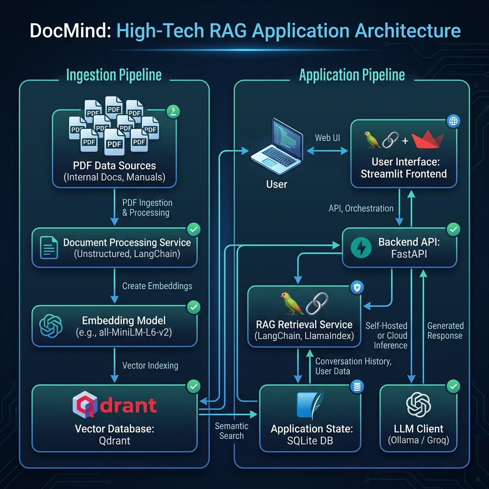

# 🤖 DocMind — Chat with Your Documents

DocMind is a Retrieval-Augmented Generation (RAG) chatbot designed to ingest PDF documents, perform offline embedding extraction, store them in a local vector database, and provide intelligent question-answering based on the document context. It offers a clean Streamlit interface, asynchronous FastAPI routing, and persistent database storage.

---

## 📌 What It Does
DocMind allows users to upload PDF documents and have natural, context-grounded conversations with their contents. It performs semantic analysis to retrieve only the most relevant text chunks, computes a confidence rating based on retrieval quality, and synthesizes answers locally (via Ollama) or on the cloud (via Groq API) while maintaining full multi-turn chat history.

---

## 🏛️ System Architecture

The following diagram illustrates how documents flow through the ingestion pipeline into Qdrant, and how queries are processed concurrently across the FastAPI backend, LLMs, and SQLite history store.



```text
                      [ INGESTION PIPELINE ]
                      
  +------------------+      +---------------------+      +----------------------+
  |  data/sample/    | ---> |   ingestion/loader  | ---> |  ingestion/chunker   |
  |  (PDF files)     |      | SimpleDirectoryReader|      |  (SentenceSplitter)  |
  +------------------+      +---------------------+      +----------------------+
                                                                    |
                                                                    v
  +------------------+      +---------------------+      +----------------------+
  |  Qdrant DB       | <--- |   ingestion/store   | <--- |  ingestion/embedder  |
  | (Vector Storage) |      | (VectorStoreIndex)  |      | (all-MiniLM-L6-v2)   |
  +------------------+      +---------------------+      +----------------------+
  
  
                      [ QUERY & INFERENCE PIPELINE ]
                      
  +------------------+      +---------------------+
  |  Streamlit UI    | ---> |    FastAPI Routes   |
  |  (Chat Interface)| <--- |   (/query endpoint)  |
  +------------------+      +---------------------+
                                       |
                                       v
                            +---------------------+      +----------------------+
                            |   QdrantRetriever   | ---> |  Qdrant Database     |
                            | (Retrieve top_k=3)  | <--- | (Similarity Search)  |
                            +---------------------+      +----------------------+
                                       |
                                       v (chunks + relevance)
                            +---------------------+      +----------------------+
                            | ResponseSynthesizer | ---> |   SQLite Database    |
                            | (Prompt & Confidence|      | (Persistent History) |
                            |  Score Computation) |      +----------------------+
                            +---------------------+
                                       |
                                       v (grounded prompt)
                            +---------------------+      +----------------------+
                            |      LLMClient      | ---> |  Ollama (llama3.2)   |
                            | (Routing/Fallback)  |      |  (Local inference)   |
                            +---------------------+      +----------------------+
                                       |                            | (if offline)
                                       v (answer text)              v
                            +---------------------+      +----------------------+
                            |    FastAPI Response | <--- |  Groq Cloud API      |
                            | (JSON Response API) |      | (llama-3.1-8b-instant)
                            +---------------------+      +----------------------+
```

---

## 🛠️ Tech Stack

| Tool | Purpose |
| :--- | :--- |
| **Streamlit** | Fast Python-based web UI for the chat interface. |
| **FastAPI** | Lightweight, asynchronous REST API backend. |
| **LlamaIndex** | Core orchestration framework for loading, chunking, and indexing. |
| **Qdrant** | High-performance vector database used to store and search embeddings. |
| **SQLite** | Lightweight file-based persistent storage for conversation history. |
| **SQLAlchemy** | Object-Relational Mapper (ORM) to interact with SQLite cleanly. |
| **sentence-transformers/all-MiniLM-L6-v2** | 80MB pre-trained embedding model that runs fully offline. |
| **Ollama** | Local LLM inference engine running models locally (e.g. `llama3.2`). |
| **Groq API** | High-speed cloud fallback for LLM completions. |
| **Docker** | Containerizes Qdrant local database. |

---

## 🌟 Features

- **Semantic Retrieval-Augmented Generation (RAG)**: Connects to a local Qdrant collection to retrieve the most contextually relevant document segments instead of basic keyword matches.
- **Hybrid Model Toggle (Ollama vs. Groq)**: Live sidebar selector in the UI allows users to toggle between local models (Ollama `llama3.2`) and cloud APIs (Groq `llama-3.1-8b-instant`) to compare speed and response quality.
- **Automatic Cloud Fallback**: If local Ollama is offline or experiences connection timeouts, the system auto-routes queries to Groq.
- **Persistent Message Store**: Moves past simple in-memory variables to SQLAlchemy-driven SQLite persistence. History survives backend server restarts.
- **RAG Trust & Transparency**:
  - **Confidence Ratings**: Displays a percentage indicating how closely related the retrieved sources are to the question.
  - **Source Citation Headers**: Fully cites which document chunks were used in an expandable UI section.
- **Session Restarts**: "➕ Start New Conversation" sidebar button resets chat context safely.

---

## 🚀 Getting Started

Follow these steps in order to clone, configure, and execute the entire project stack:

### 1. Clone the Repository
```bash
git clone https://github.com/AnubhavKiroula/docmind-rag-chatbot.git
cd docmind-rag-chatbot
```

### 2. Initialize and Activate the Virtual Environment
```bash
python -m venv venv
# On Windows:
venv\Scripts\activate
# On macOS/Linux:
source venv/bin/activate
```

### 3. Install Dependencies
```bash
pip install -r requirements.txt
```

### 4. Start the Qdrant Vector Database
Ensure Docker Desktop is running, then launch the Qdrant container:
```bash
docker compose up -d
```
Verify that Qdrant is running by accessing the web dashboard: [http://localhost:6333/dashboard](http://localhost:6333/dashboard)

### 5. Verify the Local Ollama Model
Verify that your local Ollama instance has downloaded the target model:
```bash
ollama list
```
Confirm that `llama3.2` is present. If missing, pull it:
```bash
ollama pull llama3.2
```

### 6. Configure Environment Variables
Copy the sample environment file to `.env`:
```bash
cp .env.example .env
```
Open `.env` and fill in your optional `GROQ_API_KEY`.

### 7. Place Documents and Run Ingestion
Place any PDF document you want to query inside the `data/sample/` folder (a default `sample.pdf` is provided).
Execute the ingestion script:
```bash
python scripts/ingest.py
```

### 8. Start the FastAPI Backend
```bash
python -m uvicorn main:app --reload
```
The REST API will boot on [http://localhost:8000](http://localhost:8000).

### 9. Start the Streamlit Frontend
In a new terminal window (with `venv` active), start the Streamlit web application:
```bash
streamlit run frontend/app.py
```
Open your browser to [http://localhost:8501](http://localhost:8501) to begin chatting!

---

## 🔌 API Documentation

FastAPI automatically generates interactive OpenAPI Swagger documentation. Open [http://localhost:8000/docs](http://localhost:8000/docs) in your browser to inspect or test endpoints.

### Main Routes:
- `GET /health`: Uptime status check.
- `POST /query`: Accepts query text, conversation ID, and LLM mode; drives chunk retrieval and response generation.
- `GET /conversations/{conversation_id}`: Retrieves full chat history for the given session.

---

## 📂 Project Structure

```text
docmind-rag-chatbot/
│
├── api/                       # FastAPI Web Layer
│   ├── __init__.py
│   ├── models.py              # Pydantic schemas (QueryRequest, QueryResponse)
│   └── routes.py              # Route endpoints (/health, /query, /conversations)
│
├── config/                    # Configuration Layer
│   ├── __init__.py
│   └── settings.py            # Centralized settings loading using Pydantic
│
├── db/                        # Database Layer (SQLite + SQLAlchemy)
│   ├── __init__.py
│   ├── database.py            # DB engine, session maker, init_db()
│   └── models.py              # SQLAlchemy schema models (Conversations, Messages)
│
├── data/                      # Raw PDF storage folder
│   └── sample/
│       └── sample.pdf         # Sample document for testing
│
├── docs/                      # Graphic assets
│   └── architecture.png       # Pipeline flow image
│
├── frontend/                  # Streamlit Interface Layer
│   ├── __init__.py
│   ├── api_client.py          # HTTP requests client communicating with FastAPI
│   └── app.py                 # Streamlit chat interface
│
├── ingestion/                 # Document Parsing & Storage Layer
│   ├── __init__.py
│   ├── chunker.py             # Text chunking logic
│   ├── embedder.py            # Local Hugging Face embedding loader
│   ├── loader.py              # PDF parser using SimpleDirectoryReader
│   └── store.py               # Qdrant index creator
│
├── query/                     # RAG Query Orchestration Layer
│   ├── __init__.py
│   ├── llm_client.py          # Unified Ollama / Groq API model router
│   ├── retriever.py           # Similarity search logic against Qdrant
│   └── synthesizer.py         # Grounded prompt building & confidence scoring
│
├── scripts/
│   └── ingest.py              # Script to trigger the PDF ingestion pipeline
│
├── tests/                     # Unit and Integration Test Suite
│   ├── test_api.py            # Route handler tests
│   ├── test_ingestion.py      # PDF parsing and embedding extraction tests
│   └── test_query.py          # Retriever, LLM fallback, and synthesizer tests
│
├── .env.example               # Template environment configuration
├── docker-compose.yml         # Container configuration for Qdrant database
├── main.py                    # Entry point to launch FastAPI backend
└── requirements.txt           # Python project package dependencies
```

---

## 🧠 What I Learned

- **Chunking Strategy Tradeoffs**: I experimented with `chunk_size` and `chunk_overlap`. Small chunk windows are excellent for retrieving highly targeted lines of text but lack general context, leading to LLM confusion. Large chunk windows provide rich context but increase prompt token usage and introduce noisy details, slowing down inference.
- **Vector Search vs. Keyword Search**: Relational search operates on lexical matches. RAG uses high-dimensional vector distances (Cosine similarity) to search for intent. It links synonyms like "car" and "automobile" close together in the embedding space, retrieving correct context regardless of matching key-phrases.
- **Local vs. API LLM Tradeoffs**: Designed a hybrid router. Local execution via Ollama is completely free and maintains absolute data privacy, but execution speed relies entirely on local GPU/VRAM hardware constraints. API completion via Groq is ultra-fast and handles larger parameter models but relies on internet connectivity, incurs API fees, and exports data to cloud endpoints.
- **Production API Architecture**: Implemented robust asynchronous routing, Pydantic type checking, database connection pooling via dependency injection, and clean separation between UI components and processing layers.

---

## 🔮 Future Improvements

- **Multi-Document Support**: Allow users to manage separate document directories and isolate specific books/files directly from the UI.
- **Token-by-Token Streaming**: Stream responses dynamically to the chat interface to reduce perceived user latency.
- **User Authentication**: Add JWT authorization middleware to separate private user collections and chat histories.
- **Production Deployment**: Deploy the Docker Compose stack to cloud environments (like AWS ECS or GCP Cloud Run) with a reverse proxy like Nginx.

---

## 📄 License
This project is licensed under the MIT License - see the [LICENSE](LICENSE) file for details.
